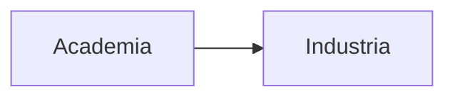
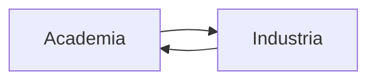

# ¿Por qué **SCA**?

--

El material que me habría gustado tener cuando realicé mi tesis.

- ¿Cómo se que mi código sigue haciendo lo que pienso que hace?{class="fragment"}
- ¿Cuáles son las mejores maneras de estructurar mi código?{class="fragment"}
- ¿Cómo hago que mi código sea más sencillo para otrxs?{class="fragment"}

--

--

---

## ¿Cómo va a ser el contenido?

--

> Screen casts 

---

## ¿Por qué en **Castellano/Español**?

- Poco material disponible en Castellano/Español{class="fragment"}
- Bajar la bara{class="fragment"}

---

## ¿Por qué en el lenguaje `Julia`?

--

Quiero profundizar mi conocimiento en el lenguaje

--

- Disañado para desarrollo de Software Científico
- Sintáxis sencilla{class="fragment"}
- Gran ecosistema de librerías científicas{class="fragment"}
- Fácil manejo de paquetes{class="fragment"}
- Buena interoperabilidad con otros lenguajes{class="fragment"}

--

- Fácil de inspeccionar el funcionamiento del programa
    - Benchmarking, Profiling{class="fragment"}
    - Ayuda a entender el funcionamiento de una computadora y las consecuencias en la performance{class="fragment"}  

---

## Qué asumo

- Sabe programar (no importa la experiencia ni lenguaje)

- Autodidacta

--

## Qué pido

- Paciencia{class="fragment"}